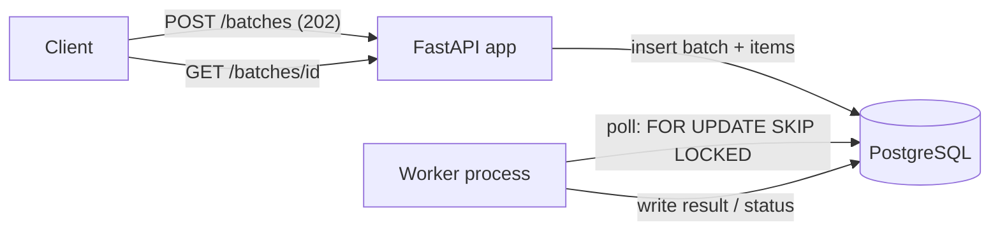
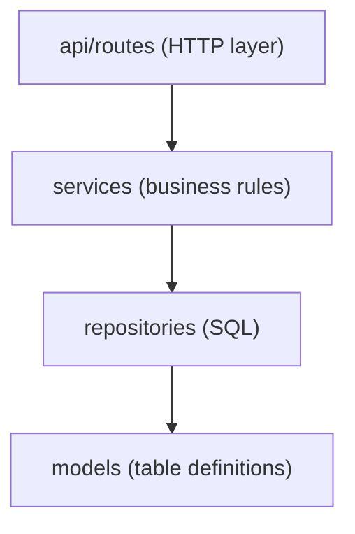

# The Complete Guide to This Project (Architecture + Code Walkthrough + Interview Prep)

This document exists so you can **explain every single part of this codebase confidently in an interview**, without memorizing anything. It is written in plain language first, then backed by exact code references so nothing here is guesswork.

How to use it:
- Read Parts 1–3 first to get the big picture in your head.
- Read Part 5 ("Request Flows") slowly — this is what interviewers actually probe the hardest, because it proves you understand your own system rather than having generated it.
- Skim Parts 6–13 once, then come back to them if the interviewer drills into a specific area (concurrency, testing, scaling, security).
- Part 15 is a big bank of likely interview questions with model answers — use it for a final review pass the night before / morning of.

---

## Part 1 — The Big Picture (explain this in 60 seconds)

**What the system does, in plain English:**

> A client sends a list of "items" (any JSON objects) to the API in one request. The API doesn't process them right away — it just saves them to the database and immediately says "got it, here's an ID, status: PENDING." A completely separate background process (the **worker**) is constantly polling the database, picking up a few pending items at a time, "processing" them, and saving the result. The client polls the API with the ID it got back to check progress and eventually see the results.

**Real-world analogy:** think of it like a restaurant order queue. You (the client) place an order and get a ticket number immediately — you don't stand at the counter while the food is cooked. The kitchen (the worker) pulls tickets off the queue at its own pace, cooks the food (processes the item), and marks it ready. You check back with your ticket number to see if it's done.

**Why does it need to work this way?** Because processing could be slow, could fail for some items and not others, and the API shouldn't be blocked waiting for slow work. This "accept now, process later" pattern is called **asynchronous processing**, and it's the correct shape for any system with the word "batch" in its name.

**The two processes:**
1. **API process** (`app/main.py`, run via `uvicorn`) — handles HTTP requests only. It never processes items itself.
2. **Worker process** (`app/worker.py`, run via `python -m app.worker`) — an infinite loop that has no HTTP server at all. Its only job is: look at the database, find work, do the work, save the result, repeat.

They **never talk to each other directly**. The only thing they share is the PostgreSQL database. This is the single most important architectural fact about this system — internalize it, because almost every design decision follows from it.

---

## Part 2 — Architecture Diagram and Why It Looks Like This



**Why PostgreSQL as the "queue" instead of a message broker (Redis/Kafka/Celery/SQS)?**

A queue's actual job is: "let one process hand off work to another, safely, even if things crash." Postgres can do this itself using a feature called row locking, specifically `SELECT ... FOR UPDATE SKIP LOCKED` (explained in depth in Part 6). Since we *already* need Postgres to store the batches and their results, using it as the queue too means:
- **One less moving part** to deploy, monitor, and pay for.
- **No dual-write problem.** If you used Postgres for data + Redis for the queue, you'd have two systems that can get out of sync (e.g., a message says "process item 5" but item 5's row doesn't exist yet, or vice versa). Because everything is one database with transactions, this can't happen.
- **Trade-off (say this out loud in the interview — it shows maturity):** a real broker (Kafka/SQS) is *pushed to* the moment work arrives, so consumers wake up instantly. Our worker *polls*, so there's up to `WORKER_POLL_INTERVAL_SECONDS` (default 1 second) of latency before an item starts being worked on. Also, Postgres row-locking has a throughput ceiling that a dedicated broker doesn't. If this system needed to process millions of items per hour, I'd swap the queue implementation for a real broker — and because of the repository pattern (see Part 3), only `BatchRepository.claim_pending_items` would need to change, not the worker's business logic.

**Why a separate worker process instead of FastAPI's `BackgroundTasks`?**

`BackgroundTasks` runs *inside the same process* as the API, right after a response is sent. This sounds convenient but is not production-safe for a batch system:
- If the API process restarts (deploy, crash, autoscaler kills it), any in-flight background task is lost — there's no record it was even supposed to run except what's in the DB, and `BackgroundTasks` isn't tied to DB transactions the way our worker's claim step is.
- It can't be scaled independently. If processing is CPU/IO heavy and submissions are cheap, you want N workers and 1–2 API instances, not a fixed 1:1 ratio.
- Our worker is a **separate OS process** started with its own command (`python -m app.worker`), so it survives independently, can be scaled with `docker compose up --scale worker=3`, and its crash doesn't take the API down (and vice versa).

**Why is everything "stateless"?**

Neither the API nor the worker keeps anything important in memory between requests/iterations — every fact about the world (what's pending, what succeeded, what failed, how many times something was retried) lives in Postgres. This means you can kill any instance of either process at any time and lose nothing except a few seconds of latency. This is *the* prerequisite for horizontal scaling.

---

## Part 3 — File-by-File Guide (what every file does and why it's there)

```
app/
  main.py                       # FastAPI app factory — wires everything together
  worker.py                     # Worker process entrypoint — the poll loop + signal handling
  api/
    deps.py                     # Dependency-injection factories (get_db → repo → service)
    error_handlers.py           # One place that turns exceptions into HTTP responses
    middleware.py                # Structured request logging (method/path/status/latency/request_id)
    routes/
      batches.py                # POST /batches, GET /batches/{id}, GET /batches/{id}/items
      health.py                 # GET /health (liveness), GET /ready (readiness)
  core/
    config.py                   # Settings (env-based configuration), get_settings()
    logging.py                  # JSON log formatter + configure_logging()
    exceptions.py                # Domain exceptions (BatchNotFoundError, BatchTooLargeError)
  database/
    session.py                  # SQLAlchemy engine + session factory + get_db() dependency
  models/
    base.py                     # SQLAlchemy DeclarativeBase
    batch.py                    # Batch and BatchItem ORM models + BatchStatus/ItemStatus enums
  schemas/
    batch.py                    # Pydantic request/response models (the API's public "shape")
  repositories/
    batch_repository.py         # ALL the SQL lives here (the only file that talks to the DB directly)
  services/
    batch_service.py            # Business logic for submit/status/list (used by the API)
    worker_service.py           # Business logic for claim → process → finalize (used by the worker)
    item_processor.py           # The actual "do work on one item" logic (pluggable interface)

alembic/                        # Database migration tooling
  env.py                        # Wires Alembic to our Settings + ORM models
  versions/..._initial_schema.py# The one migration: creates batches + batch_items tables

tests/
  conftest.py                   # Shared pytest fixtures (in-memory SQLite DB, test client)
  test_item_processor.py        # Unit tests for the processing logic
  test_batch_repository.py      # Tests for the claim/finalize SQL logic
  test_batch_service.py         # Tests for submit/status/list business logic
  test_worker_service.py        # Tests for the claim → process → finalize cycle
  test_api_batches.py           # Full HTTP-level tests (routing, validation, JSON shapes)
  test_error_handling.py        # Tests for the 503 (DB down) and 500 (unexpected bug) paths

Dockerfile                      # One image, used by all three container roles (api/worker/migrate)
docker-compose.yml              # Wires db + migrate + api + worker together for local/dev use
Makefile                        # Shortcuts: make test, make lint, make up, make migrate, ...
pyproject.toml                  # Dependencies, pytest config, ruff (linter) config
.github/workflows/ci.yml        # GitHub Actions: install → lint → test → build image
.env.example                    # Documents every environment variable the app reads
```

### Why this particular folder structure? (SOLID / separation of concerns, explained simply)

Each layer has **one job** and only talks to the layer directly below it:



- **Routes** (`app/api/routes/batches.py`) know about HTTP (status codes, query params) but contain **zero business logic**. Look at `submit_batch` — it's 3 lines. It just calls `service.submit_batch(...)` and returns whatever comes back.
- **Services** (`BatchService`, `WorkerService`) contain the actual rules ("a batch can't exceed `max_batch_size` items", "a batch is only `COMPLETED_WITH_ERRORS` if some items succeeded and some failed") but know **nothing about HTTP or FastAPI**. You could put a CLI or a gRPC server in front of `BatchService` tomorrow and it would work unchanged.
- **Repositories** (`BatchRepository`) contain **all the SQL** — the only file in the whole codebase with a `select(...)` or `.commit()` in it (besides `database/session.py`'s plumbing). This means: if you ever need to change a query, optimize an index, or even swap databases, you touch one file.
- **Models** (`Batch`, `BatchItem`) just describe what a row looks like. No behavior.

**Why does this matter for the interview?** This is literally what "testability" and "maintainability" mean in practice: `BatchService` is tested in `test_batch_service.py` with **zero** HTTP involved and **zero** real Postgres — because it only depends on a repository object and a settings object, both of which are trivial to fake or point at SQLite. That's dependency injection paying for itself.

---

## Part 4 — The Data Model, Explained Column by Column

### Table: `batches`

| Column | Type | Why |
|---|---|---|
| `id` | UUID, primary key | UUIDs (not auto-increment integers) so IDs can be generated safely by multiple processes without coordinating, and so batch IDs aren't guessable/enumerable by a client (`GET /batches/1`, `/batches/2`, ...). |
| `status` | Postgres native ENUM (`batch_status`) | One of `PENDING`, `PROCESSING`, `COMPLETED`, `COMPLETED_WITH_ERRORS`, `FAILED`. A native DB enum (not just a string column) means the *database itself* rejects an invalid value — a second line of defense beyond application code. |
| `total_items` | integer | Denormalized count captured at submission time, so you don't need to `COUNT(*)` the items table just to know how big a batch was. |
| `created_at` / `updated_at` | timestamp with time zone | `server_default=func.now()` means Postgres itself stamps the time (not the app clock), and `onupdate=func.now()` refreshes `updated_at` automatically on every change. |

### Table: `batch_items`

| Column | Type | Why |
|---|---|---|
| `id` | integer, auto-increment | A plain sequential integer is fine here — items are always accessed *through* their batch, never guessed at directly by a client, so there's no enumeration concern like with `batches.id`. Sequential IDs are also what let `ORDER BY id` give a stable claim order for the worker. |
| `batch_id` | UUID, foreign key → `batches.id`, `ondelete="CASCADE"` | If a batch were ever deleted, its items go with it automatically at the DB level. |
| `payload` | JSON | The actual item data submitted by the client — intentionally schema-less because the problem statement doesn't define a domain (see Part 8 for why). |
| `status` | Postgres native ENUM (`item_status`) | `PENDING`, `PROCESSING`, `COMPLETED`, `FAILED`. |
| `result` | JSON, nullable | What the processor produced, once completed. Null until then. |
| `error_message` | text, nullable | Set only when `status = FAILED`. |
| `attempts` | integer, default 0 | How many times the worker has tried this item. This is what retry logic is built on (Part 7). |
| `created_at` / `updated_at` | timestamp with time zone | Same pattern as `batches`. |

**Indexes** (`app/models/batch.py`, `__table_args__` on `BatchItem`):
```python
Index("ix_batch_items_status", "status")
Index("ix_batch_items_batch_id_status", "batch_id", "status")
```
- `ix_batch_items_status` exists purely to make the worker's claim query fast: `WHERE status = 'PENDING' ORDER BY id LIMIT n` — without this index, that query would need to scan the entire table on every single poll, which gets catastrophic as the table grows.
- `ix_batch_items_batch_id_status` exists for the *other* hot query: "how many items in batch X are COMPLETED/FAILED/etc." (used by both `get_item_counts` and `finalize_batch_if_complete`).

**Why JSON columns instead of a rigid schema for `payload`/`result`?** Because the problem statement ("batch processing system") doesn't specify what an "item" contains — it's intentionally domain-agnostic. JSON lets any shape of item through, while `ItemProcessor` (see Part 8) is the one pluggable seam where real, typed business logic would go in a real deployment.

**Why `enum.StrEnum` for `BatchStatus`/`ItemStatus` in Python?** So the enum member *is* a string (e.g. `BatchStatus.PENDING == "PENDING"` is `True`), which makes it trivial to serialize into JSON responses (Pydantic and FastAPI's JSON encoder handle it with no extra code) while still getting compile-time safety and autocomplete in the codebase.

---

## Part 5 — Complete Request Flows (the part interviewers dig into the most)

### 5.1 `POST /api/v1/batches` — Submitting a batch

Say a client sends:
```json
{ "items": [{"value": "hello"}, {"simulate_failure": true, "failure_reason": "boom"}] }
```

Step by step, in the order the code actually executes:

1. **Uvicorn** receives the HTTP request and hands it to the FastAPI app (`app/main.py`).
2. **`RequestLoggingMiddleware.dispatch`** (`app/api/middleware.py`) runs first — it generates a `request_id` (a UUID) and starts a timer, then calls `call_next(request)` to let the actual route run.
3. **FastAPI routing** matches `POST /api/v1/batches` to `submit_batch` in `app/api/routes/batches.py`.
4. **Pydantic validation** happens automatically before your function body even runs: the JSON body is parsed into a `BatchSubmitRequest` (`app/schemas/batch.py`). Its only field is `items: list[dict[str, Any]] = Field(min_length=1, max_length=10_000)`. If `items` were missing, empty, or not a list, FastAPI raises `RequestValidationError` right here — your route code never executes. (See 5.6 for what happens next in that case.)
5. **Dependency injection resolves `service`**: FastAPI sees `service: BatchService = Depends(get_batch_service)` and walks the dependency chain in `app/api/deps.py`:
   - `get_db()` (in `app/database/session.py`) opens a new SQLAlchemy `Session` from the connection pool.
   - `get_batch_repository(db)` wraps it in a `BatchRepository(db)`.
   - `get_batch_service(repository, settings)` wraps that in a `BatchService(repository, settings)`. `settings` comes from `get_settings()`, which is `@lru_cache`d (parsed from env vars once per process).
6. **The route body runs**: `return service.submit_batch(payload.items)` — one line, no logic.
7. **Inside `BatchService.submit_batch`** (`app/services/batch_service.py`):
   - It checks `len(items) > self.settings.max_batch_size` (default 1000). If so, it raises `BatchTooLargeError` — a plain Python exception, no HTTP concept involved (`app/core/exceptions.py`).
   - Otherwise it calls `self.repository.create_batch(items)`.
8. **Inside `BatchRepository.create_batch`** (`app/repositories/batch_repository.py`):
   - Creates one `Batch` row (`status=PENDING`, `total_items=len(items)`).
   - Creates one `BatchItem` row per item (`status=PENDING`, `payload=<the dict>`), attached via the `batch.items` relationship.
   - `session.add(batch)` then `session.commit()` — **this is one atomic transaction**. Either the batch and all its items are saved together, or (on any error) none of them are — there's no way to end up with a batch that has zero items or items with no parent batch.
   - `session.refresh(batch)` re-reads the row so the DB-generated `id`, `created_at`, etc. are populated on the Python object.
9. **Back in `BatchService`**, it builds a `BatchSubmitResponse(id=batch.id, status=batch.status, total_items=batch.total_items)` — a Pydantic model.
10. **FastAPI serializes** that Pydantic model to JSON, using the `response_model=BatchSubmitResponse` and `status_code=202` declared on the route.
11. **Control returns up through the middleware**: it logs one JSON line (`request_handled` with method, path, `202`, duration in ms, request_id) and stamps the response with an `X-Request-ID` header.
12. Client receives:
    ```json
    HTTP/1.1 202 Accepted
    X-Request-ID: <uuid>

    { "id": "…", "status": "PENDING", "total_items": 2 }
    ```

**Key thing to say in an interview:** at this point, *nothing has been processed*. The response only proves the batch was durably saved. Processing is entirely the worker's job, running in a different process, on its own schedule.

### 5.2 `GET /api/v1/batches/{id}` — Checking status

1. FastAPI parses `{id}` as a `UUID` in the route signature (`batch_id: UUID`). If it's not a valid UUID string, this fails validation before your code runs → `422`, not `404` (a common trick question — see Part 15).
2. `BatchService.get_batch_status(batch_id)` calls `repository.get_batch(batch_id)` (a simple `session.get(Batch, batch_id)` — SQLAlchemy's primary-key lookup, which checks the identity map first, then the DB).
3. If `None`, raises `BatchNotFoundError` → mapped to `404` (Part 5.6).
4. Otherwise, calls `repository.get_item_counts(batch_id)`, which runs:
   ```sql
   SELECT status, COUNT(id) FROM batch_items WHERE batch_id = :id GROUP BY status
   ```
   and turns the result into a dict with all four `ItemStatus` values defaulted to `0` (so a batch with zero `FAILED` items still returns `"failed": 0` instead of omitting the key).
5. Assembles a `BatchStatusResponse` with the batch's own `status`/`total_items`/timestamps plus the computed `counts`.

**Why is the aggregate `status` on the batch computed by the worker (at finalize time) instead of computed live from counts on every GET?** Because a `PENDING`/`PROCESSING` batch's status is a simple flag flip, but the *terminal* status (`COMPLETED` vs `FAILED` vs `COMPLETED_WITH_ERRORS`) is a business decision made once, durably, when work finishes — not something to recompute (and risk getting inconsistent) on every single status poll. The counts, on the other hand, are cheap and always fresh because they're computed live.

### 5.3 `GET /api/v1/batches/{id}/items?status=&limit=&offset=`

1. Query params are parsed with defaults/bounds from `Query(...)` (`app/api/routes/batches.py`): `status` is optional and aliased from `item_status`, `limit` defaults to `None`, `offset` defaults to `0` with `ge=0`.
2. `effective_limit = min(limit or settings.default_page_size, settings.max_page_size)` — if the client didn't ask for a specific page size, use the configured default (50); either way, never exceed `max_page_size` (200), even if the client explicitly asks for more. This protects the DB and network from an accidentally (or maliciously) huge page request.
3. `BatchService.get_batch_items` first confirms the batch exists (404 if not — **even for the items sub-resource**, so a client can't accidentally think an empty items list means "batch not found or has no items", they're distinguishable), then calls `repository.list_items(...)`.
4. `list_items` runs two queries: one `COUNT(*)` (for the `total` field, used for pagination) and one `SELECT ... ORDER BY id LIMIT ... OFFSET ...` (for the actual page), both filtered by `status` if provided.
5. Each `BatchItem` ORM object is converted to a `BatchItemResponse` via `.model_validate(item)`, which works because `BatchItemResponse` has `model_config = ConfigDict(from_attributes=True)` — this tells Pydantic "read attributes off this object like `item.id`, `item.status`, etc." instead of expecting a dict.

### 5.4 The Worker Loop — the most important flow to understand deeply

This is `app/worker.py::run()` calling into `app/services/worker_service.py::WorkerService.process_once()` in an infinite loop. Walk through exactly what happens on **one iteration**:

```mermaid
sequenceDiagram
    participant Loop as worker.py loop
    participant WS as WorkerService
    participant Repo as BatchRepository
    participant DB as PostgreSQL
    participant Proc as ItemProcessor

    Loop->>WS: process_once()
    WS->>Repo: claim_pending_items(limit=10)
    Repo->>DB: SELECT ... WHERE status='PENDING' FOR UPDATE SKIP LOCKED LIMIT 10
    DB-->>Repo: rows (locked, only for this worker)
    Repo->>DB: UPDATE status='PROCESSING', attempts+=1; COMMIT
    Repo-->>WS: claimed items
    WS->>Repo: mark_batch_processing_if_pending(batch_id) for each distinct batch
    loop for each claimed item
        WS->>Proc: process(item.payload)
        alt success
            Proc-->>WS: result dict
            WS->>Repo: save_item_result(item, COMPLETED, result)
        else ItemProcessingError or unexpected exception
            Proc-->>WS: raises
            WS->>Repo: requeue_item OR save_item_result(item, FAILED, error)
        end
    end
    WS->>Repo: finalize_batch_if_complete(batch_id) for each distinct batch
    Repo->>DB: recompute counts; set batch.status if no PENDING/PROCESSING left
    WS-->>Loop: number of items claimed
    alt claimed == 0
        Loop->>Loop: sleep(WORKER_POLL_INTERVAL_SECONDS)
    end
```

In prose, step by step (matching `WorkerService.process_once`, `app/services/worker_service.py` lines 24–44):

1. **Claim**: `repository.claim_pending_items(settings.worker_claim_batch_size)` (default 10). This is one atomic DB transaction that (a) selects up to 10 `PENDING` items using `SELECT ... FOR UPDATE SKIP LOCKED ORDER BY id LIMIT 10`, (b) flips them to `PROCESSING` and increments `attempts` on each, (c) commits. See Part 6 for exactly why `SKIP LOCKED` matters.
2. **If nothing was claimed, return `0` immediately.** The caller (`worker.py`) sees `claimed == 0` and sleeps for `worker_poll_interval_seconds` before trying again — this is the "backoff when idle" behavior that keeps an empty queue from burning CPU in a hot loop.
3. **Mark parent batches `PROCESSING`**: for every distinct `batch_id` among the claimed items, if that batch is still `PENDING`, flip it to `PROCESSING`. (Only flips once — later polls on an already-`PROCESSING` batch are no-ops here.)
4. **Process each item, one at a time, in a Python loop** (`_process_item`):
   - Calls `self.processor.process(item.payload)` — this is the pluggable business logic (Part 8). In this project, `SimulatedItemProcessor` (`app/services/item_processor.py`) either raises `ItemProcessingError` (if `payload["simulate_failure"]` is truthy) or returns `{"echo": payload, "processed_value": ...}`.
   - **On success**: `repository.save_item_result(item, COMPLETED, result=result)` — commits immediately, per item (not batched at the end), so if the worker process dies partway through claimed items 1-10, items already completed stay completed.
   - **On failure** (`_handle_item_failure`): distinguishes an *expected* failure (`ItemProcessingError`, logged as `logger.warning`) from a genuine *bug* (any other exception, logged as `logger.exception` with a full stack trace) — but both are handled identically from here: if `item.attempts < worker_max_item_attempts` (default 3), the item is **requeued** back to `PENDING` (so a future poll retries it); otherwise it's saved as terminally `FAILED` with the error message.
5. **Finalize**: for each distinct `batch_id` touched this iteration, `repository.finalize_batch_if_complete(batch_id)` recomputes the item-status counts; if any items are still `PENDING`/`PROCESSING`, it does nothing (the batch isn't done yet). Otherwise it sets the batch's terminal status:
   - `0` failed → `COMPLETED`
   - `0` completed (all failed) → `FAILED`
   - a mix → `COMPLETED_WITH_ERRORS`
   This function is **idempotent** — calling it again on an already-terminal batch is a safe no-op (it checks `batch.status in terminal_statuses` and returns `None`). This matters because multiple poll iterations across possibly-different worker instances might all "touch" the same batch near its completion.
6. **Return the count claimed.** `worker.py`'s loop only sleeps if that count was `0` — if there was work, it immediately loops again to drain the queue as fast as possible.

**Crash-safety worth explaining out loud:** if the worker process is killed (e.g. `docker stop`, OOM, node failure) at any point during steps 3–5, every item it had already committed a result for stays exactly as committed. Any item still sitting at `PROCESSING` from the claim step but never resolved is **not automatically retried by anything** in this implementation today — this is a known, honest gap (see Part 17): a truly bulletproof system would need a periodic "sweep PROCESSING items stuck longer than N minutes back to PENDING" job. I'd call this out proactively if asked "what happens if the worker dies mid-item."

### 5.5 `GET /health` and `GET /ready`

- **`/health`** (`app/api/routes/health.py`) always returns `{"status": "ok"}` with no dependencies checked at all. This is intentional: it answers "is this process alive and able to run code," nothing more. An orchestrator (Kubernetes, ECS) uses this as a **liveness probe** — if it fails, the orchestrator kills and restarts the container, assuming a restart might fix it.
- **`/ready`** runs `db.execute(text("SELECT 1"))`. If that raises anything, it returns `503` with `HTTPException`. This answers "can this process actually serve real traffic right now" — used as a **readiness probe**, which tells the load balancer "stop sending traffic here" *without* restarting the process (since the fix might just be "wait for the DB to come back," and restarting the API wouldn't help).
- **Why are these different endpoints instead of one?** If they were combined and the DB had a brief blip, an orchestrator would kill and restart *every* API replica simultaneously (thinking they're all broken), which is far more disruptive than just routing around them for a few seconds while Postgres recovers.

### 5.6 Error Flows — how every kind of failure becomes an HTTP response

All exception → HTTP mapping happens in exactly one place: `app/api/error_handlers.py::register_exception_handlers`. Three handlers are registered on the FastAPI `app`:

| Raised where | Exception type | Handler | Response |
|---|---|---|---|
| `BatchService` | `BatchNotFoundError` (subclass of `AppError`) | `handle_app_error` | `404`, `{"error": {"code": "batch_not_found", "message": "..."}}` |
| `BatchService` | `BatchTooLargeError` (subclass of `AppError`) | `handle_app_error` | `422`, `{"error": {"code": "batch_too_large", ...}}` |
| Pydantic, before your route runs | `RequestValidationError` | `handle_validation_error` | `422`, `{"error": {"code": "validation_error", "message": "...", "details": [...]}}` — `details` comes straight from Pydantic's own error list, run through `jsonable_encoder` so it's always JSON-safe. |
| `/ready`, explicitly | `HTTPException(503)` | FastAPI's own built-in handler (not overridden) | `503`, `{"detail": "database unavailable"}` |
| Literally anything else (a bug) | any other `Exception` | `handle_unexpected_error` | `500`, `{"error": {"code": "internal_error", "message": "An unexpected error occurred."}}` — the real exception and stack trace are written to the logs via `logger.exception(...)`, but **never** sent to the client. |

**Why one central place instead of `try/except` in every route?** Consistency (every error looks the same shape to clients) and safety (you can't forget to handle a case in some route and accidentally leak a stack trace — the catch-all `Exception` handler is the safety net).

**Why does `AppError` have `status_code`/`code` as class attributes instead of, say, a dict lookup somewhere?** Because it makes adding a new domain error trivial and colocated — see `BatchNotFoundError`/`BatchTooLargeError` in `app/core/exceptions.py`, each is 2 lines. No central registry to remember to update.

---

## Part 6 — Concurrency Deep Dive: What `SKIP LOCKED` Actually Does

This is the single most "senior" piece of this codebase and the thing most worth being able to explain from first principles.

**The problem:** imagine you run two worker processes at once (for scale). Both wake up at the same instant and both run `SELECT * FROM batch_items WHERE status='PENDING' LIMIT 10`. Without any locking, they'd both see the *same* 10 rows, both try to process them, and you'd double-process items — wasted work at best, corrupted results at worst (e.g. double-charging a customer if the item were "charge this card").

**The naive fix — `FOR UPDATE` (without `SKIP LOCKED`):** this tells Postgres "lock these rows for me, and don't let anyone else touch them until I commit." But if worker B runs the exact same query while worker A's transaction is still open, worker B doesn't get different rows — it just **blocks and waits** for worker A's lock to release, then re-checks the same rows (which are no longer `PENDING`, so it'd get 0, but only after waiting). Under load, all your workers end up queuing up behind each other. Bad for throughput.

**The actual fix — `FOR UPDATE SKIP LOCKED`:** tells Postgres "lock the rows you find, but if a row is already locked by someone else, just skip it and move on to the next matching row instead of waiting." So worker A and worker B, running the identical query at the identical millisecond, each walk away with a **disjoint set** of rows — no overlap, no waiting, no coordination needed between them. This is exactly the code in `app/repositories/batch_repository.py`:

```python
select(BatchItem)
    .where(BatchItem.status == ItemStatus.PENDING)
    .order_by(BatchItem.id)
    .limit(limit)
    .with_for_update(skip_locked=True)
```

**Why does marking them `PROCESSING` happen in the *same* transaction as the lock/select, committed immediately?** Because the lock is only held until the transaction ends. If we selected the rows, returned them to Python, did slow work, and *then* came back to mark them `PROCESSING` and commit — the lock would still be held that whole time (bad for other workers), *and* if this worker crashed before that final commit, the rows would revert to looking `PENDING` again with no record anything was ever attempted. By committing the status flip to `PROCESSING` (and incrementing `attempts`) immediately as part of the claim step, the claim itself is durable the instant it's committed — a crash after that point just leaves items stuck at `PROCESSING` (a known, documented gap, not a double-processing bug).

**A worked example to say out loud in an interview:**
> "Say there are 25 pending items and two worker instances both poll at once with a claim size of 10. Worker A's query runs first (even by microseconds) and locks items 1–10, flips them to `PROCESSING`, and commits. Worker B's identical query, if it started before A's commit, will skip any of items 1–10 it finds already locked and instead lock items 11–20 (or 11–25 if fewer than 10 remain unlocked). Either way, every item is claimed by exactly one worker. I verified this isn't just a theory — I actually ran a real Postgres container during development, submitted a batch, and confirmed disjoint claims across two separate `claim_pending_items` calls."

**Why doesn't the automated test suite prove this concurrency guarantee?** Because tests run against SQLite in memory (see Part 9), and SQLite has no real row-level locking — it's a single-writer database. `with_for_update(skip_locked=True)` is accepted by SQLAlchemy's SQLite dialect but is effectively a silent no-op there. The tests for `claim_pending_items` (`tests/test_batch_repository.py`) verify the *functional* contract — claimed items aren't returned again on a second call — but the true cross-process safety guarantee was verified manually against a real `postgres:16-alpine` Docker container while building this. This is an honest, important thing to volunteer rather than let the interviewer assume the tests "prove" concurrency safety they don't actually exercise.

---

## Part 7 — Failure Handling & Retry Logic Deep Dive

Every item has an `attempts` counter, incremented **at claim time** (not at failure time) in `claim_pending_items`. This single design choice is what the whole retry system is built on. Walk through the state machine for one item that always fails, with `WORKER_MAX_ITEM_ATTEMPTS=3` (the default):

| Poll # | `attempts` before | Claimed? | Processing outcome | `attempts` after | New status |
|---|---|---|---|---|---|
| 1 | 0 | yes (claim sets it to 1) | fails | 1 | `1 < 3` → requeued to `PENDING` |
| 2 | 1 | yes (claim sets it to 2) | fails | 2 | `2 < 3` → requeued to `PENDING` |
| 3 | 2 | yes (claim sets it to 3) | fails | 3 | `3 < 3` is `False` → terminally `FAILED` |

So with `max_attempts=3`, an item gets **exactly 3 tries** before giving up — the comparison `item.attempts < self.settings.worker_max_item_attempts` in `WorkerService._handle_item_failure` is what enforces the cutoff.

**Why is this valuable to call out?** It turns a single transient failure (e.g. a downstream API being briefly unavailable, if `ItemProcessor` called one) into an automatic recovery instead of an immediate, permanent failure — without needing a separate retry scheduler or delay/backoff mechanism. The trade-off: retries here are immediate (next poll, ~1 second later by default) with no exponential backoff — fine for this scale/scope, but a real production system processing against a flaky downstream dependency would likely want backoff (e.g. skip re-claiming an item for N seconds after a failure) to avoid hammering something that's struggling.

**Why does one bad item never take down the batch or the worker?** Because `_process_item` wraps the call to `self.processor.process(...)` in a `try/except Exception`, and `process_once` loops over claimed items one at a time, calling `_process_item` for each — an exception inside one iteration is fully caught and handled before the loop moves to the next item. Symmetrically, `worker.py`'s outer loop wraps the *entire* `process_once()` call in `try/except Exception` too (in case of e.g. a dropped DB connection), logs it, and just tries again next iteration — the worker process itself is designed to never crash from anything short of being explicitly killed.

---

## Part 8 — Design Decisions & Trade-offs (the "why" table)

| Decision | Alternative(s) considered | Why this was chosen | Honest trade-off |
|---|---|---|---|
| Postgres as the queue (`SKIP LOCKED`) | Redis/Celery, Kafka, SQS | Fewer moving parts; transactional consistency between job state and queue state | Polling latency (~1s); throughput ceiling of row-lock contention vs. a dedicated broker |
| Separate worker process | FastAPI `BackgroundTasks` | Durable across API restarts; scales independently of the API | Slightly more deployment surface (a second process/container to run) |
| Sync SQLAlchemy | Async SQLAlchemy (`asyncpg`) | Simpler code and tests under time pressure; FastAPI runs sync routes in a threadpool anyway | Lower per-process concurrency ceiling than a fully async stack |
| Repository pattern (`BatchRepository`) | Services talking to the ORM directly | Isolates the tricky `SKIP LOCKED` SQL in one testable place; only one file to change if the DB or query strategy changes | One extra layer/file vs. the absolute minimum |
| `ItemProcessor` interface + `SimulatedItemProcessor` | Guessing at fake "real" business logic | Problem statement is domain-agnostic; a clean, honest, pluggable seam beats a fabricated example | The actual "processing" isn't real business logic — must be swapped for a production deployment |
| Native Postgres ENUM columns | Plain `VARCHAR` + app-level validation | Extra safety: invalid values are rejected by the database itself, not just application code | ENUM types need explicit lifecycle management in migrations (see the `create_type=False` note below) — more Alembic ceremony |
| One Docker image for api + worker + migrate | Two separate images | Guarantees both processes always run identical code; simpler CI/build | Slightly larger image than a worker-only build would need (includes FastAPI/uvicorn even though the worker doesn't use them) |
| Structured JSON logs, no metrics endpoint | Implement Prometheus `/metrics` | Prioritized correctness/testing/automation within a fixed time budget | Metrics story is documented, not implemented — a real gap if asked to demo it live |
| UUID primary key for `batches`, plain int for `batch_items` | UUID for both, or int for both | Batches are addressed directly by clients (shouldn't be guessable/enumerable); items are only ever accessed *through* a batch, so a simple, fast, ordered int is fine and enables `ORDER BY id` claim ordering | Two different ID strategies in one schema — worth explaining if asked "why the inconsistency" |

**A true story worth telling in the interview** (shows debugging maturity, not just "it worked first try"): while building the initial Alembic migration, running `upgrade → downgrade → upgrade` a second time failed with `psycopg2.errors.DuplicateObject: type "batch_status" already exists`. The root cause: Postgres native ENUM types are created independently of the tables that use them — dropping the `batches` table via `op.drop_table` does **not** automatically drop the `batch_status` ENUM type it referenced. The fix (visible in `alembic/versions/..._initial_schema...py`) was to declare the enums with `create_type=False` and manage their creation/drop explicitly (`batch_status_enum.create(bind, checkfirst=True)` in `upgrade()`, `.drop(bind, checkfirst=True)` in `downgrade()`), so the migration is properly reversible. I verified this by actually running the full `upgrade → downgrade → upgrade` cycle against a real Postgres container.

---

## Part 9 — Testing Strategy Explained

**The numbers:** 40 tests, ~90% line coverage, runs in well under a second, zero external dependencies (no Docker, no network) needed to run `pytest`.

**Why SQLite in-memory instead of a real Postgres for the test suite?** Speed and hermeticity — anyone can clone this repo and run `make test` with nothing installed except Python, no Docker daemon required, no flaky CI network calls. The trade-off (stated honestly, not hidden) is that SQLite can't validate the `SKIP LOCKED` concurrency guarantee — that was verified manually against real Postgres during development (Part 6) rather than baked into the automated suite. In a longer-running real project, I'd add a second, slower, opt-in integration test tier that spins up Postgres (e.g. via `testcontainers`) specifically to assert true concurrent-claim behavior, run on CI but not on every local save.

**How the fixtures work** (`tests/conftest.py`):
- `test_settings` — a `Settings` object with tight limits (`max_batch_size=5`, `worker_max_item_attempts=2`, etc.) so tests can hit edge cases (like "over the limit") without needing to submit 1000 items.
- `db_engine` — creates a SQLite engine with `poolclass=StaticPool` (important detail: normally each new SQLite connection is a *separate* empty in-memory database; `StaticPool` forces all "connections" to reuse the same single underlying connection, so all queries in a test see the same data) and creates all tables via `Base.metadata.create_all(engine)`.
- `db_session` — a plain SQLAlchemy session bound to that engine, used by repository/service-level tests that don't need HTTP.
- `api_client` — a FastAPI `TestClient` with `get_db` and `get_settings` **dependency-overridden** to point at the SQLite engine and the tight test settings, so full HTTP-level tests run against the fake DB with no code changes to the app itself. `raise_server_exceptions=False` is set deliberately so that an unhandled exception in a route returns our real `500` JSON response (mirroring production, where a real ASGI server would do the same) instead of blowing up the test itself.

**What's covered, and why each category exists (mapped to the actual test files):**
- `test_item_processor.py` — pure unit tests of `SimulatedItemProcessor`: echo behavior, uppercase transform, both the "with reason" and "default reason" failure paths. No fixtures needed since it has no dependencies.
- `test_batch_repository.py` — the trickiest SQL logic, tested directly: claiming marks items `PROCESSING` and bumps `attempts`; a second claim call doesn't return already-claimed items; `finalize_batch_if_complete` is a no-op while items are outstanding and is idempotent once terminal; `requeue_item` resets status and clears the error message.
- `test_batch_service.py` — business rules in isolation: submit happy path, rejecting over-limit batches (and accepting exactly-at-the-limit), zeroed counts on a fresh batch, 404 on unknown IDs, status filtering and pagination disjointness.
- `test_worker_service.py` — the full claim → process → finalize cycle: empty queue returns `0`; happy path marks item+batch `COMPLETED`; partial failure finalizes as `COMPLETED_WITH_ERRORS`; all-failing finalizes as `FAILED`; a failing item is requeued *before* exhausting attempts and terminally `FAILED` *after*; a genuinely unexpected exception (`RuntimeError`, not `ItemProcessingError`) from a fake `BuggyProcessor` is still isolated and doesn't crash `process_once`; claim size is actually respected.
- `test_api_batches.py` — full HTTP-level contract tests: health/ready, the `X-Request-ID` header, submit validation (empty list, missing field, over-limit → specific error code), 404 vs 422 for batch lookups (this distinction — malformed UUID is `422` because it fails *before* reaching the service, unknown-but-valid UUID is `404` because the service explicitly checked — is a great thing to explain if asked), full submit→status→items lifecycle, pagination/filtering through the actual HTTP layer.
- `test_error_handling.py` — the two failure paths that are easy to forget: `/ready` returning `503` when the DB is unreachable (via a fake broken session dependency override), and a genuinely unexpected exception in a route returning a generic `500` **without** leaking the real exception message to the client (this is asserted explicitly: `assert "boom" not in body["error"]["message"]`).

**What's intentionally *not* unit tested, and why that's the right call, not an oversight:** `app/worker.py` itself (0% coverage) — it's pure process/signal-handling glue (`signal.signal(...)`, `time.sleep(...)`, the `while` loop) with no business logic; the actual logic it calls (`WorkerService.process_once`) is thoroughly tested. Testing `worker.py` itself would mean testing Python's signal handling and `time.sleep`, which is low-value. Instead, it was verified manually: started the process, sent it a real `SIGTERM`, confirmed it logged `shutdown_signal_received` then `worker_stopped` and exited with code `0`.

**Mocking strategy:** rather than a mocking library (e.g. `unittest.mock`), this codebase favors **fake implementations of the same interface** — e.g. `AlwaysFailProcessor` and `BuggyProcessor` in `test_worker_service.py` are real classes implementing `ItemProcessor`, and `_BrokenSession`/`_CrashingBatchService` in `test_error_handling.py` are minimal fake objects standing in for a broken DB session and a buggy service. This is a deliberate style choice: fakes are easier to read and less brittle than patching internals with `mock.patch`, and they only work at all *because* the code depends on abstractions (interfaces/injected objects) rather than concrete classes — which is the payoff of the dependency-injection design.

---

## Part 10 — Automation: Docker, Compose, Makefile, CI Explained

### `Dockerfile`

One image, `python:3.12-slim` base, used for **three different roles** depending on the command it's launched with (`uvicorn ...` for the API, `python -m app.worker` for the worker, `alembic upgrade head` for the one-shot migration job). Why one image instead of three? All three roles need the exact same application code and dependencies — building separately would risk them drifting out of sync (e.g. the worker running slightly stale code vs. the API). The image:
1. Installs `curl` (needed only so the container's own `HEALTHCHECK`/compose healthcheck can call `/health`).
2. Copies `pyproject.toml`, `app/`, `alembic/`, `alembic.ini` and runs `pip install .` (installing the app itself as a package, using the dependency list from `pyproject.toml`).
3. Creates and switches to a non-root user (`appuser`, uid 1000) — a basic container security practice (if the app were ever compromised, the attacker doesn't get root inside the container).
4. Default `CMD` runs the API; `docker-compose.yml` overrides this per-service.

### `docker-compose.yml`

Four services:
- **`db`** — `postgres:16-alpine`, with a `pg_isready` healthcheck so dependent services know when it's actually ready to accept connections (not just "container started").
- **`migrate`** — runs `alembic upgrade head` once and exits. `depends_on: db: condition: service_healthy` means it won't even try until Postgres is confirmed ready.
- **`api`** — `depends_on` both `db` (healthy) and `migrate` (`condition: service_completed_successfully` — i.e., the migration container must have **exited with code 0**, not just started) before starting. Has its own `curl -f http://localhost:8000/health` healthcheck.
- **`worker`** — same dependency ordering as `api`. No exposed port (it has no HTTP server) and no healthcheck of its own (there's nothing meaningful to health-check from outside — its "health" is really "is it still logging progress," which is a logging/observability concern, not a container-level one).

**Why the explicit `migrate` step instead of running migrations from inside the API's own startup code?** Running migrations from application startup is a common anti-pattern once you scale to multiple API replicas — you don't want N replicas racing to run the same migration simultaneously. A single, separate, one-shot job that must complete successfully before anything else starts is the safe, standard pattern.

**How this demonstrates horizontal scaling concretely:** `docker compose up --scale worker=3` runs three worker containers, all polling the same Postgres queue, all safe from double-processing because of `SKIP LOCKED` (Part 6) — no code change required to scale.

### `Makefile`

Just a thin, memorable wrapper around commands you'd otherwise have to remember (`make test`, `make lint`, `make up`, `make migrate`, `make migration m="..."`). One detail worth mentioning: it computes `PYTHON := $(shell [ -x .venv/bin/python ] && echo .venv/bin/python || echo python3)` so the same Makefile works whether you've activated the virtualenv or not, and works unmodified inside CI (where dependencies are installed directly, no `.venv`).

### `.github/workflows/ci.yml`

Triggers on every push to `main` and every pull request. Steps: checkout → set up Python 3.12 (with pip caching) → `pip install -e ".[dev]"` → `ruff check .` (lint) → `pytest --cov=app --cov-report=term-missing` (test) → `docker build` (proves the image still builds). **Fails fast**: any step failing (lint errors, a failing test, a broken Dockerfile) stops the pipeline with a non-zero exit code, which is what makes a CI check "red" on a PR.

**Why lint *and* test *and* build in one job, not three parallel jobs?** For a project this size, the overhead of parallelizing across three separate CI jobs (each paying its own environment-setup cost) isn't worth it yet — one sequential job that fails fast on the cheapest check first (lint, which takes under a second) is simpler and still fast in absolute terms. This is the same "don't over-engineer" principle applied to the CI pipeline itself.

---

## Part 11 — Operational Excellence: Logging, Config, Health

### Logging (`app/core/logging.py`)

A custom `logging.Formatter` subclass (`JsonFormatter`) turns every log record into one JSON line: `timestamp` (UTC, ISO-8601), `level`, `logger` (the module name), `message`, plus **anything passed via `extra={...}`** merged in automatically (it walks `record.__dict__` and skips only the standard/reserved `LogRecord` attributes). If the log call happened inside an `except` block via `logger.exception(...)`, the full formatted traceback is included under `"exception"`.

Why write a custom formatter instead of adding a dependency like `python-json-logger`? It's about 30 lines of code, has zero dependencies, and avoids adding a package for something this small — a "don't over-engineer" call.

`configure_logging()` is called once at startup by **both** the API (`app/main.py::create_app`) and the worker (`app/worker.py::run`), replacing the root logger's handlers with one `StreamHandler(sys.stdout)` using the JSON formatter, and setting the level from `settings.log_level`. It also quiets `uvicorn.access` to `WARNING`, since our own `RequestLoggingMiddleware` already logs every request with richer, structured fields — leaving uvicorn's default access log on would just be redundant noise.

### Request logging (`app/api/middleware.py`)

Every single HTTP request produces exactly one log line: `request_handled` with `request_id`, `method`, `path`, `status_code`, `duration_ms`. The `request_id` (a fresh UUID per request) is also echoed back as an `X-Request-ID` response header — if a client reports "my request failed," you ask for that header value and can find the exact log line instantly, instead of grepping by timestamp and guessing.

### Configuration (`app/core/config.py`)

One `Settings` class (Pydantic `BaseSettings`) is the single source of truth for every tunable in the system — nothing is hardcoded elsewhere. It reads from actual environment variables first, falling back to a local `.env` file (via `model_config = SettingsConfigDict(env_file=".env", ...)`), falling back to the defaults written directly in the class. `get_settings()` is `@lru_cache`d so parsing only happens once per process, and both FastAPI (`Depends(get_settings)`) and the worker (`get_settings()` called directly at startup) use it identically. Full variable list documented in `.env.example`.

### Health (`/health`, `/ready`) — see Part 5.5 above for the deep-dive.

### Metrics (documented, not implemented — say this proactively, don't wait to be asked)

There is no `/metrics` endpoint in this codebase. If asked to add real metrics, the plan (which I can state precisely because I know exactly what data already exists to build it from):
- **Request count / latency / error rate by route** — a Prometheus histogram wrapping exactly the same measurement `RequestLoggingMiddleware` already takes (`time.perf_counter()` around `call_next`), labeled by `method`, `path`, `status_code`.
- **Items processed / failed / retried** — counters incremented at the exact same points `WorkerService._process_item`/`_handle_item_failure` already log from.
- **Queue depth** — a gauge set from `SELECT COUNT(*) FROM batch_items WHERE status = 'PENDING'`, sampled periodically. This is the single most important number for deciding *when* to scale up worker replicas — a growing queue depth despite constant claim throughput is the textbook autoscaling signal for this kind of system.

---

## Part 12 — Security Review

| Concern | Status | Detail |
|---|---|---|
| SQL injection | Mitigated | Every query goes through SQLAlchemy's query builder (`select(...)`, `.where(...)`) — no raw string-interpolated SQL anywhere in the codebase. |
| Input validation | Mitigated | Pydantic validates every request body/path/query param before any business logic runs (`BatchSubmitRequest`, path `UUID` typing, `Query(ge=...)` bounds). |
| Secrets management | Mitigated | No secrets hardcoded; `DATABASE_URL` etc. come from environment variables (`.env` locally — gitignored — a real secrets manager in production). |
| Non-root container | Mitigated | `Dockerfile` creates and switches to `appuser` (uid 1000) before `CMD`. |
| Information disclosure on error | Mitigated | The catch-all exception handler (Part 5.6) never returns exception text/stack traces to the client — only a generic message; full detail goes to logs only. |
| Authentication | **Not implemented** | Anyone who can reach the API can submit/read batches. Out of scope by design for this exercise; would be a single middleware (API key or JWT verification) in front of the routers — the thin-router design makes this a localized addition, not a rearchitecture. |
| Authorization (multi-tenant isolation) | **Not implemented** | There's no concept of "whose batch is this" — any client can read any batch by ID (UUIDs make them non-guessable, which is a mitigation, not a substitute for real authz). |
| Rate limiting | **Not implemented** | A client could submit unboundedly many batches (each individually capped at `max_batch_size`, but nothing caps request *frequency*). Would add a per-client rate limiter (e.g. token bucket keyed by API key/IP) at the middleware layer if required. |
| Dependency vulnerabilities | Not actively scanned | No `pip-audit`/Dependabot configured in this exercise; would add to CI in a real deployment. |

Being able to state plainly "here's what's covered, here's what's explicitly out of scope and why, here's exactly where I'd add it" is a stronger signal than pretending a small exercise implemented enterprise-grade auth.

---

## Part 13 — Scalability Deep Dive

**What's already stateless and horizontally scalable, today, with zero code changes:**
- **API**: run N replicas behind a load balancer; each one independently opens its own DB connection pool (`pool_size=5, max_overflow=10` per process — be careful, this multiplies by replica count against Postgres's own `max_connections`).
- **Worker**: run N replicas (`docker compose up --scale worker=3`); safe by construction via `SKIP LOCKED` (Part 6).

**Current bottlenecks, in order of what would bite first as load grows:**
1. **Postgres connection count** — each API/worker process holds its own pool; too many replicas can exhaust Postgres's `max_connections`. Mitigation: a connection pooler like PgBouncer in front of Postgres.
2. **Worker poll latency & row-lock contention** — throughput is bounded by how fast `claim_pending_items` transactions can commit and by `WORKER_POLL_INTERVAL_SECONDS`. Mitigation at moderate scale: lower the poll interval and/or raise `WORKER_CLAIM_BATCH_SIZE`; at high scale: replace the Postgres-queue with a real broker (only `BatchRepository`'s claim method would need to change, per the repository pattern).
3. **Single Postgres instance** — everything (data + queue) lives on one database. Mitigation: read replicas for the read-heavy status/items endpoints (with the caveat of replication lag for freshly-submitted batches), and eventually splitting "queue" storage from "results" storage if they need to scale independently.
4. **Large batches (`max_batch_size`)** — a single `POST` inserting, say, 1000 rows in one transaction is a real cost on the API request path. Mitigation: keep the limit conservative in production (it's already configurable per environment via `MAX_BATCH_SIZE`) or move to chunked/streamed inserts for very large batches.

**Connection pooling detail worth citing exactly:** `app/database/session.py` — `pool_pre_ping=True` means every checked-out connection is pinged before use, so a connection that went stale (e.g. Postgres restarted, a firewall dropped an idle connection) is transparently replaced instead of surfacing as a confusing mid-request error.

**Future scaling path, concretely, in order:**
1. Lower `WORKER_POLL_INTERVAL_SECONDS` / raise `WORKER_CLAIM_BATCH_SIZE` — free, config-only.
2. Add more worker replicas — free, already safe.
3. Add PgBouncer in front of Postgres — addresses connection-count ceiling.
4. Add a queue-depth-based autoscaler for the worker deployment (scale workers up when `pending` count grows).
5. If/when polling latency or Postgres lock contention becomes the actual bottleneck (not before — avoid solving a problem you don't have yet): swap the queue implementation for SQS/Celery/Kafka behind the same `BatchRepository` interface.

---

## Part 14 — Glossary (say these correctly, confidently)

- **Idempotent** — doing something twice has the same effect as doing it once. `finalize_batch_if_complete` is idempotent: calling it on an already-`COMPLETED` batch is a safe no-op.
- **`SKIP LOCKED`** — a SQL clause (used with `SELECT ... FOR UPDATE`) that tells the database "skip any row that's currently locked by another transaction, instead of waiting for it." Lets multiple consumers safely divide up work from the same table.
- **At-least-once processing** — a delivery/processing guarantee where an item is guaranteed to be processed one or more times, but never zero times. (Contrast with "exactly-once," which is much harder to guarantee in distributed systems.) This system is at-least-once: a crash at the wrong moment could theoretically mean an item gets processed more than its `attempts` count suggests, but never silently dropped.
- **Liveness vs. readiness probe** — liveness answers "should this process be restarted?"; readiness answers "should traffic be routed here right now?" (`/health` vs `/ready`, Part 5.5).
- **Dependency injection (DI)** — supplying an object's dependencies (e.g. a DB session, a repository) from the outside rather than having it construct them itself. `app/api/deps.py` is FastAPI's `Depends()`-based DI wiring.
- **ORM (Object-Relational Mapper)** — a library (SQLAlchemy here) that lets you work with database rows as Python objects (`Batch`, `BatchItem`) instead of writing raw SQL by hand for every operation.
- **Migration (Alembic)** — a versioned, scripted change to the database schema, so schema changes are tracked in source control and can be applied/reverted consistently across environments, instead of manually running `ALTER TABLE` by hand.
- **Structured logging** — logging in a consistent, machine-parseable format (JSON here) instead of free-form text, so logs can be queried/filtered by field in a log aggregator.
- **Horizontal scaling** — handling more load by running more copies of a stateless process, as opposed to "vertical scaling" (making one instance bigger/faster).
- **Connection pooling** — reusing a fixed set of database connections across many requests instead of opening a new one every time (expensive) — `pool_size`/`max_overflow` in `app/database/session.py`.

---

## Part 15 — Interview Question Bank (with model answers grounded in this exact code)

### Architecture & design

**Q: Walk me through what happens when a client submits a batch.**
A: Give the Part 5.1 walkthrough — validation → DI resolves the service → `BatchService.submit_batch` checks the size limit → `BatchRepository.create_batch` inserts the batch + all items in one transaction → `202` returned immediately with nothing processed yet.

**Q: Why didn't you use Celery/RabbitMQ/SQS?**
A: See Part 8's table. Core answer: fewer moving parts, transactional consistency (no dual-write problem), and Postgres's `SKIP LOCKED` is sufficient at this scale. State the trade-off unprompted: polling latency and eventual throughput ceiling vs. a dedicated broker.

**Q: How would you scale this to 10x, 100x, 1000x the load?**
A: Walk through Part 13's ordered list — config tuning → more worker replicas → PgBouncer → queue-depth autoscaling → swap to a real broker only once actually bottlenecked, behind the same repository interface.

**Q: Why is the worker a separate process instead of a background task in the API?**
A: Durability across API restarts + independent scaling — see Part 2. Concretely: `BackgroundTasks` runs in-process and is lost on restart; our worker is a wholly separate OS process with its own lifecycle, started via `python -m app.worker`.

**Q: What would you do differently if you had another day?**
A: Cite the README's "Future Improvements" honestly: `Idempotency-Key` support, a real `/metrics` endpoint, API-key auth + rate limiting, batch cancellation, and — only if actually needed — swapping the queue for a real broker.

### Concurrency

**Q: Two workers poll at the same instant. Walk me through exactly what happens at the database level.**
A: Give the Part 6 worked example verbatim (25 items, two workers, disjoint claims via `SKIP LOCKED`).

**Q: What if you used `FOR UPDATE` without `SKIP LOCKED`?**
A: The second worker would block waiting for the first transaction's lock instead of getting different rows — serializing your workers instead of parallelizing them.

**Q: How do you know two workers won't process the same item?**
A: Because the claim (lock + flip to `PROCESSING` + commit) is one atomic transaction, and `SKIP LOCKED` guarantees a locked-but-uncommitted row is invisible to any other transaction's identical claim query.

**Q: What happens if the worker crashes right after claiming an item but before finishing it?**
A: Be honest here — this is the system's real known gap (Part 5.4/Part 17). The item stays at `PROCESSING` forever unless something explicitly sweeps it back to `PENDING`. State the fix you'd add: a periodic job requeuing items stuck at `PROCESSING` longer than some threshold.

### Data & correctness

**Q: Why UUID for batch IDs but a plain integer for item IDs?**
A: Batches are addressed directly by external clients — UUIDs prevent enumeration/guessing. Items are only ever accessed *through* a batch (`/batches/{id}/items`), so a simple sequential integer is fine, cheaper, and gives a natural, stable claim order (`ORDER BY id`).

**Q: How do you compute a batch's overall status?**
A: Not live on every read — it's set once, durably, by the worker's `finalize_batch_if_complete`, based on aggregate item-status counts, the moment no items remain `PENDING`/`PROCESSING`. The per-status *counts* shown to the client, though, are always computed live (Part 5.2), so progress is always fresh even while a batch is mid-flight.

**Q: What does `COMPLETED_WITH_ERRORS` mean and why have it instead of just `COMPLETED`/`FAILED`?**
A: A batch where *some* items succeeded and *some* permanently failed. Collapsing that into `FAILED` would hide the completed work; collapsing it into `COMPLETED` would hide that something needs attention. It's a three-way logical split, not a nice-to-have.

**Q: Why native Postgres ENUM types instead of a plain string column?**
A: Defense in depth — the database itself rejects an invalid status value, not just application code. Trade-off: ENUM types need explicit lifecycle management in migrations (tell the `create_type=False` / manual create-drop story from Part 8 here — it's a great "I hit a real bug and fixed it" story).

### Testing

**Q: How do you test something that depends on Postgres-specific behavior (`SKIP LOCKED`) without a real Postgres in CI?**
A: Give the honest answer from Part 9/Part 6: automated tests run against SQLite and verify the *functional* contract (no double-claims within a single test), while the true concurrent-safety guarantee was verified manually against a real Postgres container during development. State what you'd add with more time: an opt-in `testcontainers`-backed integration tier in CI.

**Q: Why fakes instead of `unittest.mock`?**
A: Fakes (small real classes implementing the same interface, e.g. `AlwaysFailProcessor`) are more readable and less brittle than patching internals, and they only work because the code is built around interfaces/injected dependencies in the first place — which is itself evidence the DI design is paying off.

**Q: What's not covered by your tests, and why?**
A: `app/worker.py`'s loop/signal-handling code (0% coverage by design — it's glue code with no business logic, verified manually instead) and the true cross-process concurrency guarantee (see above). Say this before being asked — it reads as self-awareness, not a gotcha.

### Failure handling & reliability

**Q: What happens if item processing throws an exception your code didn't anticipate?**
A: `_process_item` catches `Exception` broadly (not just the expected `ItemProcessingError`), logs it via `logger.exception` (full traceback), and still applies the same retry/fail logic — a bug in the processor degrades gracefully into "this item failed" rather than crashing the whole worker loop. Demonstrated by `BuggyProcessor` in the test suite.

**Q: What happens if the database is unreachable?**
A: For the API: `/ready` returns `503` (checked via `SELECT 1`), so a load balancer stops routing traffic here without killing the process; `/health` still returns `200` since the process itself is fine. For the worker: `worker.py`'s outer loop catches any exception from a poll iteration, logs it, and retries after the normal backoff — it never crashes on a transient DB blip.

**Q: How do retries work, exactly?**
A: Give the Part 7 state-machine table verbatim with `max_attempts=3`.

### Security

**Q: Is this safe against SQL injection?**
A: Yes — every query is built with SQLAlchemy's query builder, never raw string interpolation.

**Q: What's missing from a security standpoint?**
A: Be direct: no authentication, no authorization, no rate limiting — all explicitly out of scope for this exercise, each with a stated, concrete plan to add (Part 12).

### Operational / DevOps

**Q: How would you deploy this?**
A: One Docker image, three roles via command override (`docker-compose.yml`); `migrate` runs once to completion before `api`/`worker` start; a real deployment target would be the same shape on ECS/Kubernetes — `db` as managed Postgres (RDS etc.), `api` and `worker` as independently-scaled deployments/services.

**Q: How do you debug a specific failed request in production?**
A: Every request logs one line with a `request_id`, also returned as the `X-Request-ID` response header — grep logs for that exact ID to get the full picture (method, path, status, latency) instantly.

**Q: What would you monitor / alert on?**
A: Request error rate and p99 latency (derivable today from the existing structured request logs even without a metrics backend), queue depth (`COUNT(*) WHERE status='PENDING'` — the key worker-autoscaling signal), and item failure rate.

---

## Part 16 — Curveball / "Gotcha" Questions

**Q: "Isn't polling wasteful/inefficient? Why not use `LISTEN`/`NOTIFY`?"**
A: Postgres does support pub/sub via `LISTEN`/`NOTIFY`, which would reduce latency further without adding a new piece of infrastructure. It wasn't used here to keep the implementation simple and because 1-second polling latency was an acceptable trade-off for this problem's scope — but it's a legitimate, lower-latency alternative that stays entirely within Postgres, worth mentioning as a "future improvement" if you want to look extra sharp.

**Q: "What if `max_batch_size` is 1000 but someone submits exactly 1000 one-megabyte JSON payloads?"**
A: The current system doesn't cap total request/payload size, only item *count*. In production I'd add a request body size limit at the reverse-proxy/ASGI-server layer, independent of the item-count business rule.

**Q: "Your worker claims 10 items, but what if processing item #3 takes 10 minutes? Does that block items 4–10?"**
A: No — `_process_item` is called sequentially in a plain Python `for` loop *within one worker process*, so yes, a single slow item does delay the rest of that worker's batch of 10 — but it doesn't block *other* worker processes, which are independently polling and claiming their own items. If item-level parallelism within one worker mattered, you'd process the claimed batch with a thread/async pool instead of a sequential loop — a reasonable next step, not implemented here to keep things simple.

**Q: "Why commit after every single item instead of batching all 10 into one commit at the end?"**
A: Durability of partial progress — if the worker crashes after item 5 of 10, items 1–5 stay `COMPLETED` rather than the whole batch-of-10 rolling back and being reprocessed from scratch. The cost is more, smaller transactions instead of fewer, larger ones — a deliberate trade-off favoring correctness/resilience over raw throughput.

**Q: "Your enum test settings use `worker_max_item_attempts=2` — isn't that inconsistent with the production default of 3?"**
A: Deliberate — smaller numbers in test fixtures (`tests/conftest.py`'s `test_settings`) make tests fast and let you exercise "just before the limit" and "just after the limit" behavior in 1–2 poll iterations instead of needing 3+, without changing what's actually being tested.

**Q: "What's the actual bottleneck if I stress-test this right now?"**
A: Be honest: without load-testing it, the best answer grounded in the design is "Postgres row-lock contention on the claim query and/or the connection pool ceiling (5 + 10 overflow per process)," per Part 13 — and say you'd confirm with an actual load test rather than guess further.

---

## Part 17 — Known Limitations (say these proactively — it builds trust)

1. **No sweep for items stuck at `PROCESSING`** if a worker dies mid-item (Part 5.4/16). Fix: a periodic job requeuing items whose `updated_at` on `PROCESSING` is older than some threshold.
2. **No real metrics endpoint** — documented, not implemented (Part 11).
3. **No authentication/authorization/rate limiting** — explicitly out of scope (Part 12).
4. **Retries have no backoff** — an item fails and is immediately eligible for the next poll (~1s later), not delayed (Part 7).
5. **The `SKIP LOCKED` concurrency guarantee isn't exercised by the automated test suite** (only manually verified) because the suite runs on SQLite (Part 9).
6. **`ItemProcessor` is a simulation, not real business logic** — by design, since the problem statement doesn't define a domain (Part 8).

Volunteering this list unprompted, with a clear one-line fix for each, reads as far stronger engineering judgment than waiting for the interviewer to find them.

---

## Part 18 — One-Page Cheat Sheet (last-minute review)

- **What it is**: submit a batch of JSON items → `202` + ID immediately → separate worker processes them in the background → poll for status/results.
- **Two processes, one shared database**: `api` (FastAPI/uvicorn) and `worker` (`python -m app.worker`); Postgres is the only thing they share.
- **The queue IS Postgres**: `SELECT ... FOR UPDATE SKIP LOCKED` lets multiple workers claim disjoint rows with zero coordination.
- **Layering**: routes (thin) → services (business rules) → repositories (all SQL) → models (table shape).
- **State machine — batch**: `PENDING → PROCESSING → COMPLETED / FAILED / COMPLETED_WITH_ERRORS`.
- **State machine — item**: `PENDING → PROCESSING → COMPLETED` or `PENDING → PROCESSING → PENDING (requeued, retry) → ... → FAILED` (after `WORKER_MAX_ITEM_ATTEMPTS`, default 3).
- **Errors**: one central handler maps `AppError` subclasses (404/422), Pydantic `RequestValidationError` (422), and anything else (500, generic message, full detail only in logs).
- **Health**: `/health` = am I alive (no DB check); `/ready` = can I serve real traffic (DB check, 503 if not).
- **Tests**: 40 tests, ~90% coverage, SQLite in-memory, sub-second run; `SKIP LOCKED` concurrency verified manually against real Postgres instead.
- **Deploy**: one Docker image, three roles (`api`/`worker`/`migrate`) via command override, wired in `docker-compose.yml` with proper health-based startup ordering. Actually deployed and verified end-to-end on a real DigitalOcean droplet (Part 19).
- **Scale**: both processes stateless → run more of either; worker scaling is safe by construction (`SKIP LOCKED`); Postgres itself is the eventual bottleneck (Part 13).
- **Biggest interview trap to avoid**: don't claim the test suite proves concurrency safety — it proves functional correctness on SQLite; concurrency safety was verified manually on real Postgres. Say this proactively.

---

## Part 19 — Real Cloud Deployment (DigitalOcean)

This section documents an actual, live deployment of this exact codebase to DigitalOcean — not a hypothetical. Everything below (IDs, IP, command output) is real, captured during the deployment. Being able to say "I didn't just design for a cloud VM, I deployed to one and hit it over the public internet" is a strong signal in an interview.

### 19.1 Why this shape (and not App Platform / Kubernetes)

The original design (Part 2) explicitly assumed "deployment to a cloud VM running `docker compose up`" as the simplest production-shaped target. This deployment reuses that assumption exactly rather than introducing a new deployment model under time pressure:

| Option | Why not chosen |
|---|---|
| DigitalOcean App Platform | Would require re-modeling the 4-service Compose stack as separate App Platform "components" plus a managed database add-on — more moving parts and account setup for no interview-relevant benefit here. |
| Managed Kubernetes (DOKS) | Massive overkill for a single-node demo; the whole point of the original design was avoiding unjustified distributed-systems complexity (Part 8). |
| Single Droplet + Docker Compose (chosen) | Reuses `docker-compose.yml` verbatim, matches the documented deployment assumption, fastest to stand up and tear down. |

### 19.2 Sizing decision

The droplet needed to satisfy two constraints simultaneously:
- Small enough to be "the smallest viable slug size" (the ask).
- Large enough to run Postgres + API + worker containers together without the OOM killer, and to meet the minimum disk size required by the pre-installed Docker marketplace image.

| Slug | RAM | Disk | Price/mo | Verdict |
|---|---|---|---|---|
| `s-1vcpu-512mb-10gb` | 512MB | 10GB | $4 | Rejected — 10GB disk is below the 25GB minimum required by the `docker-20-04` marketplace image, and 512MB is a real OOM risk running 3 containers + Postgres together. |
| `s-1vcpu-1gb` (chosen) | 1GB | 25GB | $6 | Smallest size that satisfies both constraints. |

The `docker-20-04` marketplace image ("Docker on Ubuntu 22.04") ships with Docker Engine + the Compose plugin pre-installed, which removes a manual `apt-get install docker` step from the critical path — the main lever for "fast deploy" given the size was otherwise fixed.

### 19.3 Resource segregation

All resources for this deployment were created inside a brand-new, dedicated DigitalOcean Project, kept separate from every other pre-existing resource in the account:

```bash
doctl projects create \
  --name "batch-processing-interview-demo" \
  --purpose "Interview take-home: batch processing service" \
  --description "Segregated resources for the batch processing service DigitalOcean deployment" \
  --environment Development
# -> Project ID: e8efe8d8-4c03-4e93-8515-1765e2a9202d
```

The droplet was then explicitly assigned into that project:

```bash
doctl projects resources assign e8efe8d8-4c03-4e93-8515-1765e2a9202d \
  --resource=do:droplet:582178899
```

This is purely organizational — nothing was torn down as part of this deployment (see 19.7) — but it means cleanup later is "delete this one project's resources" instead of finding one droplet among many unrelated ones.

### 19.4 Provisioning commands (as actually run)

```bash
# Firewall: only SSH (22) and the API port (8000) are reachable from the internet.
# Postgres's 5432 is intentionally NOT opened here, even though docker-compose.yml
# maps it to the host for local-dev convenience -- the firewall is what actually
# keeps it private on a public droplet, not a code change.
doctl compute firewall create \
  --name "batch-svc-interview-demo-fw" \
  --inbound-rules "protocol:tcp,ports:22,address:0.0.0.0/0,address:::/0 protocol:tcp,ports:8000,address:0.0.0.0/0,address:::/0" \
  --outbound-rules "protocol:tcp,ports:1-65535,address:0.0.0.0/0,address:::/0 protocol:udp,ports:1-65535,address:0.0.0.0/0,address:::/0 protocol:icmp,ports:0,address:0.0.0.0/0,address:::/0" \
  --droplet-ids 582178899

# Droplet: smallest size that fits both the app and the pre-installed Docker image.
doctl compute droplet create batch-svc-interview-demo \
  --region blr1 \
  --size s-1vcpu-1gb \
  --image docker-20-04 \
  --ssh-keys 56642055 \
  --tag-names interview-demo \
  --wait
# -> Droplet ID: 582178899, Public IP: 206.189.133.120, Status: active
```

### 19.5 Shipping the code and deploying

The project was not (yet) a git repository, so code was shipped with `rsync` over SSH rather than `git clone`:

```bash
rsync -avz --delete \
  --exclude '.venv' --exclude '__pycache__' --exclude '.pytest_cache' \
  --exclude '.ruff_cache' --exclude '.specstory' --exclude '.git' \
  --exclude '*.egg-info' --exclude '.coverage' --exclude 'htmlcov' \
  -e "ssh -i ~/.ssh/poc_key" \
  ./ root@206.189.133.120:/root/batch-processing-service/
```

Then, on the droplet, the exact same command a developer would run locally:

```bash
ssh -i ~/.ssh/poc_key root@206.189.133.120
cd /root/batch-processing-service
docker compose up --build -d
```

Real result — all four services came up in dependency order exactly as designed (`db` healthy → `migrate` ran and exited 0 → `api`/`worker` started):

```
NAME                                IMAGE                             STATUS                    PORTS
batch-processing-service-api-1      batch-processing-service-api      Up 16 seconds (healthy)   0.0.0.0:8000->8000/tcp
batch-processing-service-db-1       postgres:16-alpine                Up 25 seconds (healthy)   0.0.0.0:5432->5432/tcp
batch-processing-service-worker-1   batch-processing-service-worker   Up 16 seconds             8000/tcp (internal)

$ docker compose logs migrate --no-log-prefix
INFO  [alembic.runtime.migration] Context impl PostgresqlImpl.
INFO  [alembic.runtime.migration] Will assume transactional DDL.
INFO  [alembic.runtime.migration] Running upgrade  -> cc2fcff00cdb, initial schema: batches and batch_items
```

### 19.6 End-to-end verification from outside the droplet

All of the following were run from a separate machine against the droplet's public IP over plain HTTP on port 8000 (no VPN, no SSH tunnel) — this proves the firewall, Docker port mapping, and app are all correctly wired together, not just that the containers run.

**Health, readiness, and request correlation:**

```bash
$ curl -s http://206.189.133.120:8000/health
{"status":"ok"}

$ curl -s http://206.189.133.120:8000/ready
{"status":"ready"}

$ curl -sD - -o /dev/null http://206.189.133.120:8000/health | grep -i x-request-id
x-request-id: 31393297-a609-4511-91e7-7b8bca384896
```

**Error handling still correct remotely (404 / 422s):**

```bash
$ curl -s http://206.189.133.120:8000/api/v1/batches/00000000-0000-0000-0000-000000000000
{"error":{"code":"batch_not_found","message":"Batch 00000000-0000-0000-0000-000000000000 was not found."}}
# HTTP 404

$ curl -s http://206.189.133.120:8000/api/v1/batches/not-a-uuid
{"error":{"code":"validation_error","message":"Request failed validation.", ...}}
# HTTP 422

$ curl -s -X POST http://206.189.133.120:8000/api/v1/batches -d '{"items": []}'
{"error":{"code":"validation_error","message":"Request failed validation.", ...}}
# HTTP 422
```

**Full lifecycle — submit a batch with a deliberate simulated failure, then poll to completion:**

```bash
$ curl -s -X POST http://206.189.133.120:8000/api/v1/batches \
    -H 'Content-Type: application/json' \
    -d '{"items": [{"value": "hello-do"}, {"value": "second-item"}, {"simulate_failure": true, "failure_reason": "forced failure for cloud e2e test"}]}'
{"id":"884f1b2d-8965-452b-a717-54f04d56f515","status":"PENDING","total_items":3}

# ... poll GET /api/v1/batches/{id} ...
{"id":"884f1b2d-8965-452b-a717-54f04d56f515","status":"COMPLETED_WITH_ERRORS","total_items":3,
 "counts":{"pending":0,"processing":0,"completed":2,"failed":1},
 "created_at":"2026-07-04T04:05:11.174386Z","updated_at":"2026-07-04T04:05:12.089863Z"}
```

`GET /api/v1/batches/{id}/items` confirmed the per-item detail: items 1 and 2 `COMPLETED` with `result.processed_value` set (uppercased `value`), item 3 `FAILED` after exactly 3 `attempts` with `error_message: "forced failure for cloud e2e test"` — matching `WORKER_MAX_ITEM_ATTEMPTS=3`.

The worker's structured JSON logs on the droplet independently confirm the retry sequence:

```
{"level": "WARNING", "logger": "app.services.worker_service", "message": "item_processing_failed", "item_id": 3, "attempts": 1, "expected": true}
{"level": "WARNING", "logger": "app.services.worker_service", "message": "item_processing_failed", "item_id": 3, "attempts": 2, "expected": true}
{"level": "WARNING", "logger": "app.services.worker_service", "message": "item_processing_failed", "item_id": 3, "attempts": 3, "expected": true}
```

This is the same claim → process → retry → finalize flow described in Part 5.4 and Part 7, now proven against a real Postgres instance on a real cloud VM instead of the SQLite test suite.

### 19.7 Trade-offs and teardown (documented, not executed)

- **No domain/TLS**: verification used plain HTTP on the droplet's public IP:8000. Out of scope for this pass since the goal was proving the deployment and app logic work, not standing up production-grade edge infrastructure. A real production rollout would put a domain + Caddy/nginx with Let's Encrypt (or a DigitalOcean Load Balancer) in front of `api`, terminating TLS before traffic reaches the container.
- **The droplet is intentionally left running** after this verification so it can be used for a live demo. It costs ~$6/month while running.
- **Teardown, when needed**, is a single project-scoped cleanup (not run here):

```bash
doctl compute droplet delete batch-svc-interview-demo --force
doctl compute firewall delete 25cf32f6-e3df-4b9c-ac31-801d6b577360 --force
doctl projects delete e8efe8d8-4c03-4e93-8515-1765e2a9202d
```

### 19.8 New interview Q&A from this exercise

**Q: "Have you actually deployed this anywhere, or only designed for deployment?"**
A: Yes — it's running on a DigitalOcean droplet (`s-1vcpu-1gb`, Docker Compose, the same image built from this repo's `Dockerfile`), verified end-to-end over its public IP: health/ready checks, validation errors, and a full submit → worker-processes → retry → finalize lifecycle with a deliberately-failing item, all confirmed against the live instance.

**Q: "What's different between this deployment and what you'd do for real production traffic?"**
A: Three things: (1) TLS via a domain + reverse proxy or load balancer instead of raw HTTP on an IP, (2) a managed Postgres instance (e.g. DigitalOcean Managed Databases/RDS) instead of a `db` container sharing the same droplet as the app, so the database survives independently of the app's lifecycle and gets automated backups, and (3) `api`/`worker` running as separately-scaled services (multiple droplets/App Platform components/Kubernetes deployments behind a load balancer) rather than one droplet running everything — all changes are purely infrastructural, no application code changes needed, which is the payoff of the layered design (Part 8).

---
