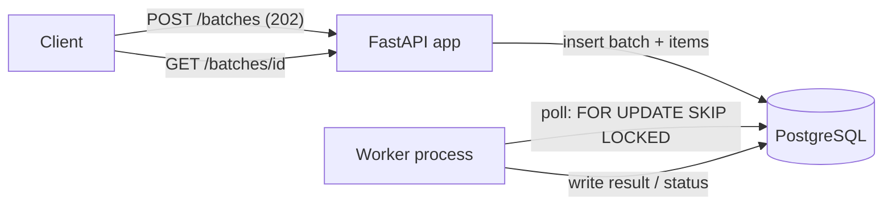

# Batch Processing Service

A production-grade service for submitting batches of items for asynchronous
processing. Clients submit a batch over HTTP and get an id back immediately;
a separate worker process claims and processes items in the background;
clients poll for status and results.

## Overview

- **API**: FastAPI app for submitting batches and querying status/results.
- **Worker**: a standalone process that claims pending items from Postgres
  and processes them.
- **Queue**: PostgreSQL itself, via `SELECT ... FOR UPDATE SKIP LOCKED` —
  no separate broker (Redis/Kafka/Celery) is used or needed at this scale.

## Architecture



Both `api` and `worker` are stateless and share nothing but the database, so
either can be scaled horizontally by running more instances (`docker compose
up --scale worker=3`).

### Component responsibilities

| Layer | Responsibility |
|---|---|
| `app/api/routes` | HTTP routing and request/response shape only |
| `app/services` | Business logic (`BatchService`, `WorkerService`) and the pluggable `ItemProcessor` |
| `app/repositories` | All SQL, including the `SKIP LOCKED` claim query |
| `app/models` | SQLAlchemy ORM models |
| `app/schemas` | Pydantic request/response contracts |
| `app/core` | Config, logging, domain exceptions |
| `app/worker.py` | Poll loop, signal handling (process orchestration only) |

### Data model

- **`batches`**: `id` (UUID), `status` (`PENDING → PROCESSING → COMPLETED /
  COMPLETED_WITH_ERRORS / FAILED`), `total_items`, timestamps.
- **`batch_items`**: `id`, `batch_id` (FK), `payload` (JSON), `status`
  (`PENDING/PROCESSING/COMPLETED/FAILED`), `result` (JSON), `error_message`,
  `attempts`, timestamps. Indexed on `status` (worker poll) and
  `(batch_id, status)` (progress queries).

### Request lifecycle (submit → process → poll)

1. `POST /api/v1/batches` validates the payload, inserts one `Batch` row and
   N `BatchItem` rows in a single transaction, and returns `202` immediately
   with the batch id. Nothing is processed synchronously.
2. The worker polls in a loop: it claims a small batch of `PENDING` items
   with `FOR UPDATE SKIP LOCKED` (so multiple worker instances never claim
   the same row), marks them `PROCESSING`, and commits — this is what makes
   the claim durable even if the worker crashes immediately after.
3. Each claimed item is processed independently. A failure in one item is
   caught and isolated; it never aborts the rest of the batch. Failures are
   retried up to `WORKER_MAX_ITEM_ATTEMPTS` times (requeued to `PENDING`)
   before being marked terminally `FAILED`.
4. Once no items in a batch remain `PENDING`/`PROCESSING`, the batch is
   finalized to `COMPLETED` (all succeeded), `FAILED` (all failed), or
   `COMPLETED_WITH_ERRORS` (mixed) — this finalize check is idempotent.
5. Clients poll `GET /api/v1/batches/{id}` for aggregate status/counts and
   `GET /api/v1/batches/{id}/items` for paginated per-item results.

## API Endpoints

| Method | Path | Description |
|---|---|---|
| `POST` | `/api/v1/batches` | Submit a batch of items. Returns `202` with `{id, status, total_items}`. |
| `GET` | `/api/v1/batches/{id}` | Batch status + progress counts. `404` if unknown. |
| `GET` | `/api/v1/batches/{id}/items` | Paginated items (`?status=&limit=&offset=`). |
| `GET` | `/health` | Liveness probe. Never touches the DB. |
| `GET` | `/ready` | Readiness probe. Checks DB connectivity; `503` if unreachable. |

Errors follow one consistent shape: `{"error": {"code": "...", "message": "...", "details": [...] }}`.

## Validation & Error Handling

- Request shape is validated by Pydantic (`min_length=1` on `items`,
  malformed JSON/UUIDs rejected before reaching business logic).
- The authoritative `max_batch_size` is enforced in `BatchService` (not just
  the schema), so it's tunable per environment via an env var without a code
  change.
- All exceptions are mapped centrally in `app/api/error_handlers.py`:
  domain errors (`BatchNotFoundError` → 404, `BatchTooLargeError` → 422) get
  their specific code/message; anything unexpected is logged with full
  detail server-side and returns a generic `500` — no internals ever leak
  to the client.

## Logging & Observability

- Structured JSON logs (stdout) via a custom formatter — ready to ship to
  any log aggregator.
- One log line per HTTP request (method, path, status, latency,
  `request_id`), with the `request_id` also returned as an `X-Request-ID`
  response header for client-side correlation.
- Every item failure and retry is logged with `item_id`, `batch_id`, and
  `attempts`.

**Metrics** (not implemented — see Trade-offs): the request-logging
middleware already captures everything needed to derive request count,
latency, and error rate from logs; for a real deployment I'd export
Prometheus counters/histograms for: request count/latency/status by route,
items processed/failed/retried, and current queue depth (`COUNT(*) WHERE
status='PENDING'`), which is also the key autoscaling signal for the worker.

## Configuration

All configuration is environment-based via `app/core/config.py`
(`pydantic-settings`), with sensible local defaults. See
[.env.example](.env.example) for the full list:

| Variable | Default | Purpose |
|---|---|---|
| `DATABASE_URL` | local Postgres | Used by both API and worker |
| `MAX_BATCH_SIZE` | 1000 | Max items per submission |
| `DEFAULT_PAGE_SIZE` / `MAX_PAGE_SIZE` | 50 / 200 | Pagination bounds |
| `WORKER_POLL_INTERVAL_SECONDS` | 1.0 | Backoff when the queue is empty |
| `WORKER_CLAIM_BATCH_SIZE` | 10 | Items claimed per poll iteration |
| `WORKER_MAX_ITEM_ATTEMPTS` | 3 | Retries before an item is terminally FAILED |

## Security

- All input is validated (Pydantic) before touching the database; all
  queries go through SQLAlchemy's parameterized query builder — no raw SQL
  string interpolation anywhere, so SQL injection isn't a viable vector.
- No secrets are hardcoded; `DATABASE_URL` and friends come from the
  environment (`.env` locally, real secrets manager in production).
- The container runs as a non-root user (`appuser`).
- Not implemented (out of scope, documented as a known gap): authentication/
  authorization and rate limiting. In a real deployment this is a single
  API-key or JWT-verification middleware in front of the routers — the
  thin-router design makes that a localized change.

## Assumptions

- **What "processing" an item means is intentionally abstracted.** The
  problem statement doesn't specify a domain, so `ItemProcessor` is a small
  pluggable interface; `SimulatedItemProcessor` is a deterministic stand-in
  (echoes the payload, uppercases a `value` field, and raises on
  `{"simulate_failure": true}` so failure handling is fully testable and
  demoable). Swapping in real business logic means implementing one
  interface — everything else (retries, status tracking, worker loop) is
  unchanged.
- Single-region deployment, moderate throughput — no need for a distributed
  broker at this scale (see Trade-offs).
- At-least-once item processing semantics: if the worker crashes after
  processing but the finalize step hasn't run, the next poll's idempotent
  finalize check self-heals. An item is never processed *fewer* than once,
  but could in rare crash windows be processed more than its recorded
  `attempts` implies retried work was durably discarded — acceptable given
  the item processor is expected to be idempotent-safe or side-effect-light,
  which should be a documented contract for any real processor.

## Trade-offs

- **Postgres-as-queue vs. Celery/Redis/SQS.** Fewer moving parts, and
  transactional consistency between job state and queue state (no dual-write
  problem between an app DB and a separate broker). Trade-off: polling
  introduces up to `WORKER_POLL_INTERVAL_SECONDS` latency, and throughput is
  bounded by Postgres row-lock contention — migrate to a real broker if/when
  volume demands it.
- **Separate worker process vs. FastAPI `BackgroundTasks`.** `BackgroundTasks`
  dies with the request/process and can't scale independently of the API —
  not durable enough for a "batch processing system". A dedicated worker
  process is durable and horizontally scalable on its own.
- **Sync SQLAlchemy vs. async.** Chosen for simplicity and testability under
  time pressure; FastAPI runs sync endpoints in a threadpool so request
  concurrency is still fine at this scale.
- **No metrics endpoint.** Documented instead of implemented, to prioritize
  correctness, testing, and the automation story within the time budget.

## Future Improvements

In priority order if more time were available:
1. Idempotency-Key support on submission (dedupe retried client requests).
2. Prometheus `/metrics` (request/latency/error histograms, queue depth gauge).
3. API-key or JWT authentication + basic rate limiting.
4. Batch cancellation endpoint.
5. Switch to a real broker (SQS/Celery) if throughput requires it.

## Local Setup

Requires Python 3.11+ and Docker.

```bash
make install          # create .venv and install deps
cp .env.example .env  # adjust DATABASE_URL if not using Docker's Postgres
```

## Running Locally

Full stack (Postgres + migration + API + worker) via Docker Compose:

```bash
make up          # docker compose up --build -d
make logs        # tail all service logs
make down        # tear down
```

Or run the API/worker against Docker's Postgres only:

```bash
docker compose up -d db
make migrate
make run          # API on http://localhost:8000
make worker       # in a second terminal
```

Interactive API docs: `http://localhost:8000/docs`.

## Running Tests

```bash
make test         # pytest, SQLite in-memory -- no Docker required
make test-cov     # with coverage report
make lint         # ruff
```

40 tests, ~90% coverage. Tests cover: submission happy path, size-limit
validation, 404s, malformed input, pagination/filtering, the claim →
process → finalize cycle (success, partial failure, all-fail, retry/requeue,
and an *unexpected* exception in the processor to confirm it's isolated),
and centralized error handling (503 on DB-down, generic 500 without leaking
internals). SQLite has no real row locking, so `claim_pending_items` is unit
tested for functional correctness there; the actual cross-process
`SKIP LOCKED` concurrency guarantee was verified manually against a real
Postgres container during development (submit → two independent claims →
correct disjoint sets, verified via `docker run postgres:16-alpine`).

## Deployment

Ships as a single Docker image; `api` and `worker` are the same image run
with different commands (`docker-compose.yml`), so they can never drift.

Required environment variables: `DATABASE_URL` (required in real
deployments — the default points at `localhost`), plus anything in
[.env.example](.env.example) worth overriding.

Startup order (`docker-compose.yml` encodes this via `depends_on` +
healthchecks): Postgres becomes healthy → `migrate` runs `alembic upgrade
head` and exits → `api`/`worker` start.

Health checks: the `api` container's Docker healthcheck hits `/health`;
a real orchestrator (k8s, ECS) should point its liveness probe at `/health`
and readiness probe at `/ready`.

Assumed target: a single cloud VM running `docker compose up`, or a
container orchestrator (ECS/k8s) with the same three logical services
(`db` as a managed Postgres instance, `api` and `worker` as independently
scalable deployments).

## Scalability

- **Stateless services**: both `api` and `worker` hold no in-memory state;
  scale either horizontally by running more instances.
- **Connection pooling**: `pool_size=5, max_overflow=10, pool_pre_ping=True`
  on the SQLAlchemy engine — stale connections are detected and replaced
  rather than surfacing as request failures.
- **Worker scaling**: `docker compose up --scale worker=3` — safe because
  `SKIP LOCKED` guarantees disjoint claims across workers.
- **Future scaling**: if Postgres-as-queue becomes the bottleneck (very high
  item volume), swap `BatchRepository.claim_pending_items` for a real
  broker-backed implementation — `WorkerService` doesn't need to change.
